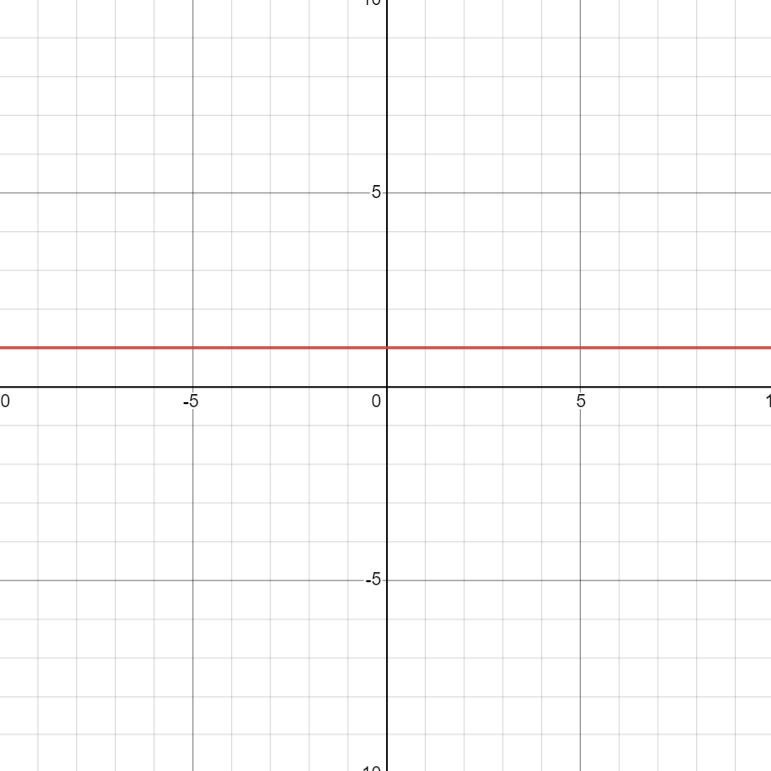
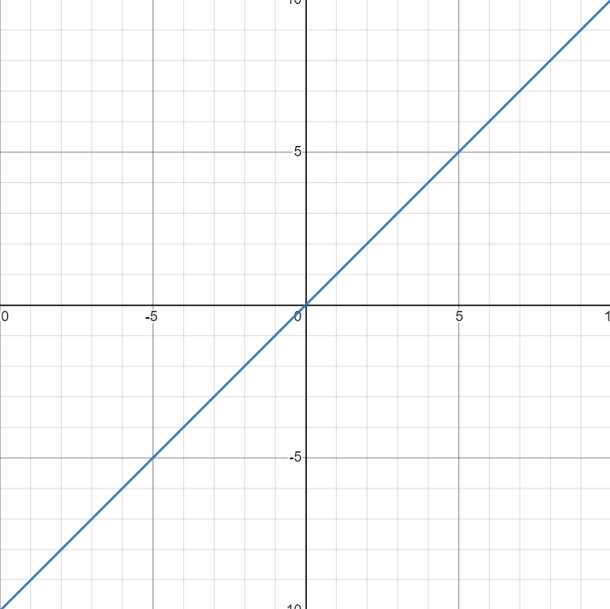
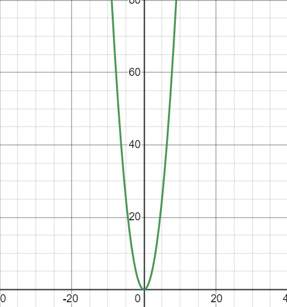
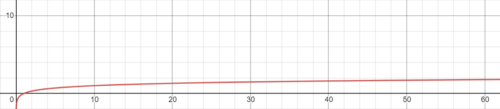
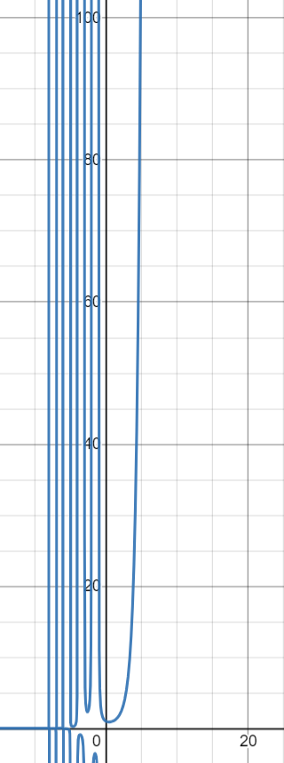
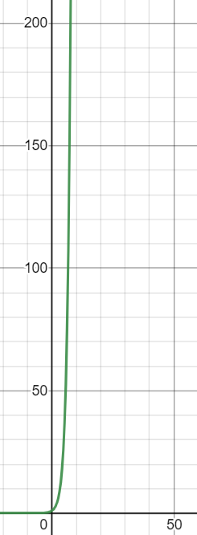

# `Big O Notation`
## What is big O notation?
#
Big O Notation is essential to learning the efficiency of algorithms and the way data is read and modified.

Big O Notation comprises mainly of one element: `Efficiency`

## How does one `determine` efficiency?
#
There are many types of efficiencies of Big O Notation:
* $O(1)$
* $O(n)$
* $O(n^2)$
* $O(log(n))$
* $O(n!)$
* $O(2^n)$

Now what do each of these notations mean? I think it's best if we visualize what each notation LOOKS like.

`NOTE: X axis = Amount of items in a list. Y axis = Amount of possible iterations for the given amount of items.`

><br>$O(1)$</br>
</img>
<br>You'll Notice this is a flat line. That's because this has grabbed an item on the first pass. This either means the system got lucky finding what it was looking for, or it knew exactly where it was and knew where to find it. Here's a code example for this algorithm.
</br>

```python 
    def findFirstPerson():
        list = ["Bob", "Tim", "Sue"]

        firstPerson = list[0]
        return firstPerson
```

>$O(n)$<br></br>
</img>
<br>
O of N is a more standard algorithm. This can be viewed as a for loop in python because N is equal to the number of items it's iterating through. Here's a code example for this algorithm.
</br>

```python
    def findNum(number, n): # n = array of numbers
        for num in n:
            if number == n:
                return num
```

>$O(n^2)$<br></br>
</img>
<br>
As you can see O of N squared is a bit more inefficient than most algorithms here. For 1 item it takes 1 iteration. For 2 it can take up to 4. It's exponential, which makes it fairly slow and inefficient for most uses, but not entirely useless. Here's what an O of N squared algorithm would look like in code form. 
</br>
```python
numbers = ['1', '2', '3', '4', '5', '6']
letters = ['a', 'b', 'c']

for number in numbers:
    for letter in letters:
        print(number + letter) 
        # prints all possible 1 to 1 combinations between lists

```

>$O(log(n))$<br></br>
</img>
<br>
Well would you look at this. This algorithm looks very efficient! With lots of items it seems to be able to have few iterations. This is one of the most efficient notations out there and is a very nice one as well. This can be achieved when shortening your iterations every time you looks through. See the programming example below.
</br>

```python
    numbers = [1, 2, 3, 4, 5, 6, 7, 8, 9, 10]

    number_to_find = 6
    found = False

    while not found:

        middle_index = int(round(len(numbers)/2, 0)) # Middle Index

        if numbers[middle_index] == number_to_find: # Number Found
            found = True

        elif numbers[middle_index] >= number_to_find:
            numbers = numbers[:middle_index] # Sets the numbers array from the 0th index to the middle index. [1, 2, 3, 4, 5, 6]
        
        else:
            numbers = numbers[middle_index:] # Sets the numbers array from the middle index to the last index. [6, 7, 8, 9, 10]
```

>$O(n!)$<br></br>
</img>
<br>
Oh my... what's going on here? This seems to be O to the Factorial! This is very inefficient! As you can see, 5 items can take up to 120 searches! Whew, that's a lot! When is this ever called though? Well, O of N factorial is usually done when finding all possible combinations, or permutations. Consider the following code.
</br>

```python
    import random # Used to randomize a list

    sorted_list = [1, 2, 3, 4, 5]
    unsorted_list = [5, 2, 4, 3, 1]

    # O(n!) because it can go up to all possible combinations
    # Before returning a sorted list
    def sort_array(sorted_list, unsorted_list):
        iterations = 0
        while unsorted_list != sorted_list: # Runs until equal to the sorted array
            random.shuffle(unsorted_list)
            iterations += 1 # +1 for every time iterated
        return iterations
```

>$O(2^n)$<br></br>
</img>
<br>
Well well well what do we have here? Looks like the most inefficienct algorithm we have! How in the world does this happen? Usually algorithms with O of 2^n is usually when it's growth doubles with recursion done with it. This as you have possibly guessed, uses recursion to get results this high. Take this pseudocode for example.
</br>
```python
    def do_something(one_thing, another_thing):

        while one_thing is happening:
            another_thing happens
            yet_another_thing appears
            possibly_a_thing exists
            
            if not possibly_a_thing:
                thing = do_something(another_thing, yet_another_thing)
            else:
                thing = do_something(another_thing, possibly_a_thing)
        
        return a_thing
```